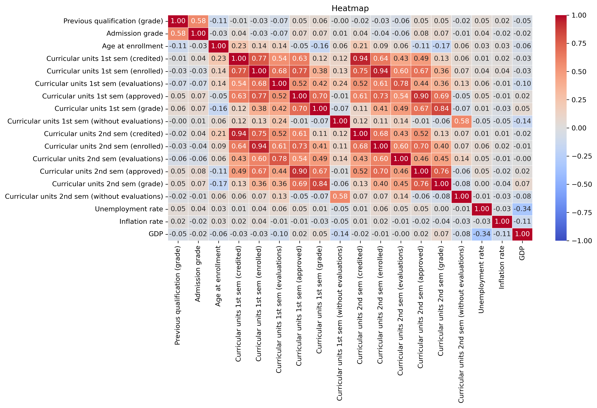
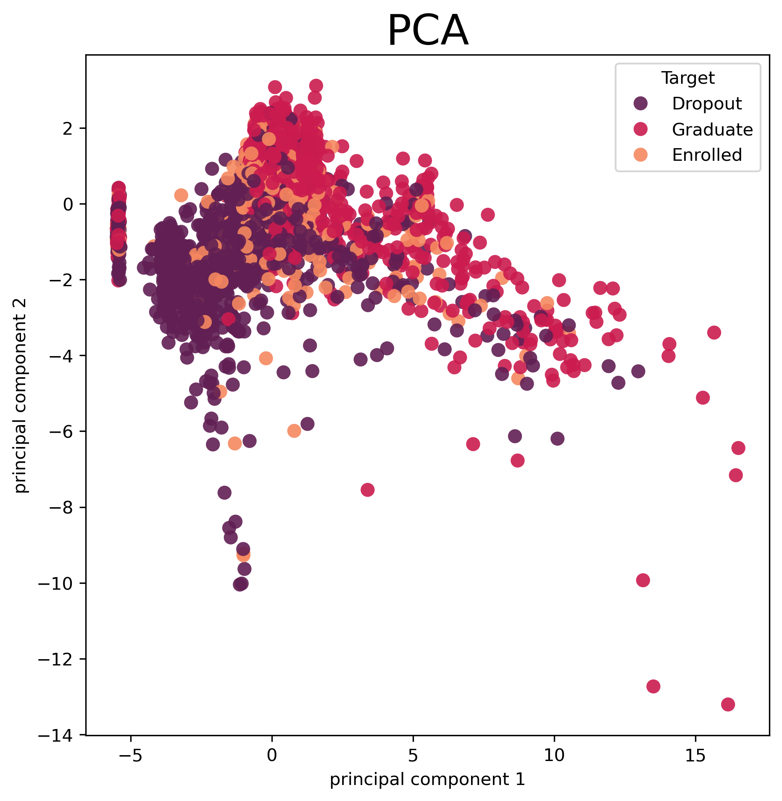
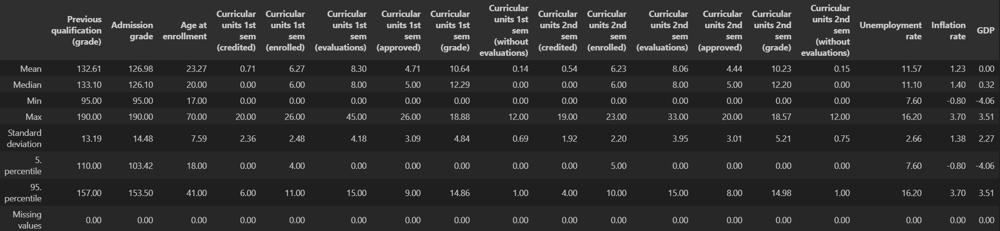
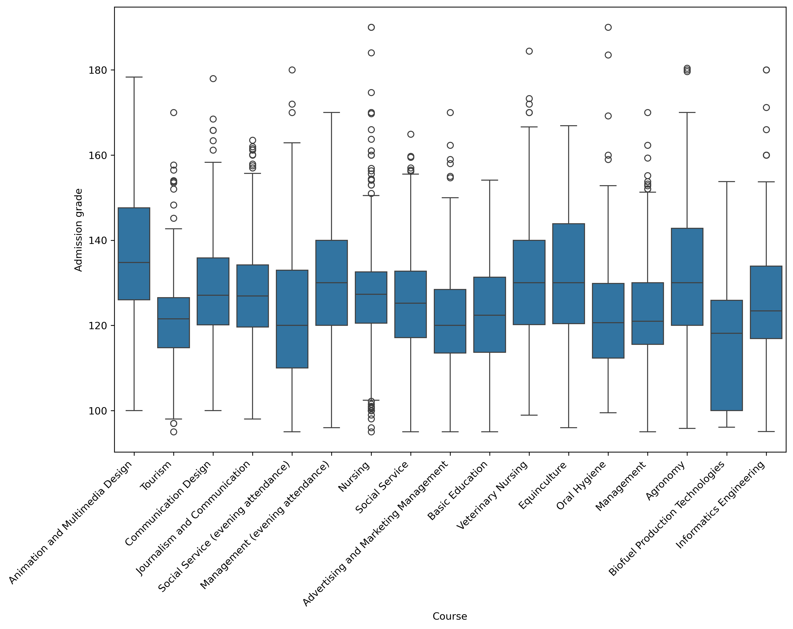
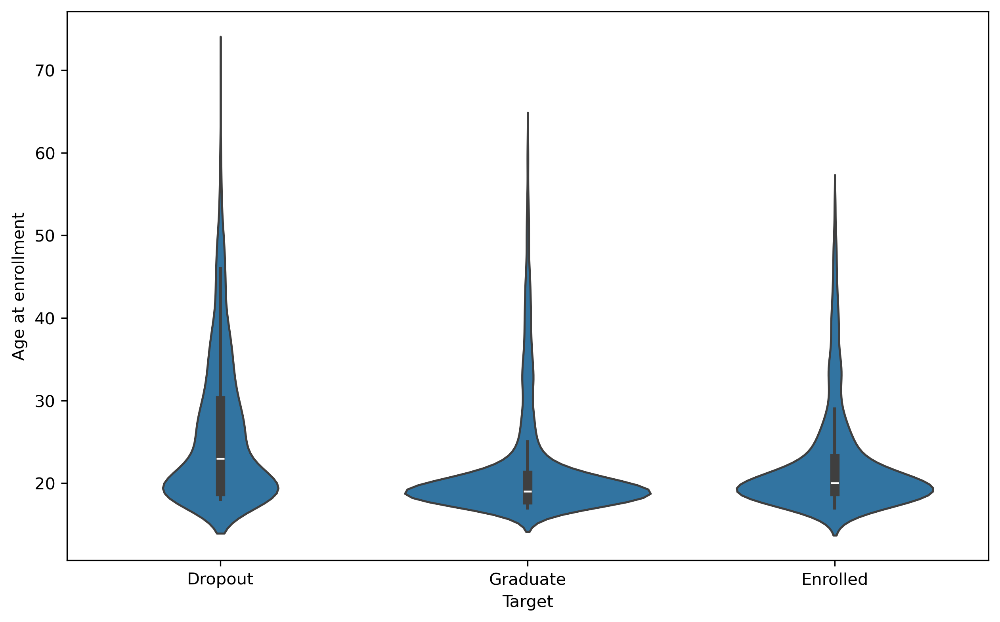
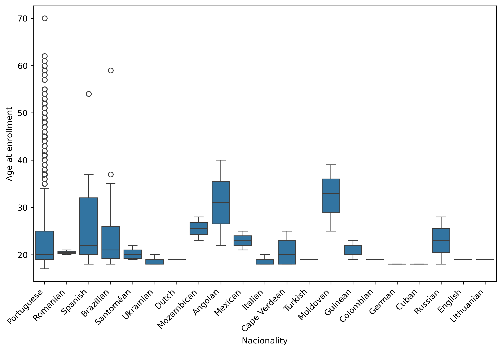

# Raport

## Data overview

# Heatmap

* No surprise that curricular units params in the 1st sem (credited, enrolled, evaluations, approved, grade) are correlated
* High correlation between admission grade and previous qualification grade
* Small negative correlation between age at enrollment and grades
* Negative correlation between GDP and unemployment rate
* Inflation rate isn't significantly correlated with GDP and unemployment (surprising)

# PCA

We can see different categories on PCA chart are clustered
* Droput students category appears more towards the left side of the chart
* Graduate students category appears more towards the upper and left sides of the chart
* Enrolled students category is spread across the chart but often is situated between dropout student and graduate students category

# Numeric statistics

# Categorical statistics
Most common categories:
* Application mode -> 1st phase - general contingent (38.61%)
* Application order -> 2nd choice (68.40%)
* Course -> Nursing (17.31%)
* Daytime evening attendance -> Daytime (89.08%)
* Deptor -> No (88.63%)
* Displaced -> Yes (54.84%)
* Educational special needs -> No (98.85%)
* Father's occupation -> Unskilled Workers (22.83%)
* Father's qualification -> Basic Ed 1st Cycle (4th/5th) (27.33%)
* Gender -> Female (64.83%)
* International -> No (97.51%)
* Maritial status -> single (88.58%)
* Mother's occupation -> Unskilled Workers (35.65%)
* Mother's qualification -> Secondary Enducation (24.16%)
* Nacionality -> Portuguese (97.51%)
* Previous qualification -> Secondary education (84.02%)
* Scholarship holder -> No (75.16%)
* Target -> Graduate (49.93%)
* Tuition fees up to date -> Yes (88.07%)

## Correlation detected

### Gender
.png)
.png)
* More females decide to study, especially in younger age groups

### Admission and previous qualification grades
.png)
* Droput students score worse grades as an admission grade than enrolled students and graduates

* Biofuel Production Technologies students tend to score worse on admission grade for some reason...
* The best scores have Animation and Multimedia Design students

### Age at enrollment

.png)
* The older students are they are more likely to dropout
* dropout males are on average older than dropout females

* Most middle ages and elderly students are from Portugal
* Brazilian, Spanish, Angolan and Moldovan students tend to enroll later

### 1st sem

.png)
.png)
* Students who dropout often don't take evaluations at all during 1st sem
* Students who are deptors try to take more evaluations than students without debt because of liability

.png)
.png)
.png)
* Many dropouts receive terrible grades in the 1st semester
* If they are debtors or scholarship holders they are less likely to receise such bad grades (probably they care more because of liablity)

.png)
.png)
.png)
* Most dropouts pass 0-2 units in the first semester - incredibly low number
* Most of them don't have scholarship (debt doesn't matter here)
* Graduates pass most units in the 1st semester

### Economic
.png)
.png)
.png)
* Increasing GDP + low unemployment and inflation rates --> more students become deptors

## No correlation - weird

### Admission grade and age don't correlate

